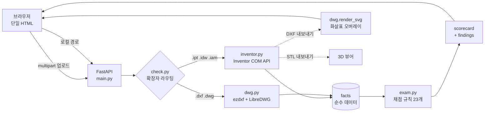

# 도면 자가진단기 — 전산응용기계제도기능사 자동 채점

> CAD 도면을 올리면 **실제 채점 기준으로 점수를 매기고, 어디가 왜 틀렸는지와 고치는 방법**을 알려줍니다.
> 화면에 그려진 그림을 보는 게 아니라, **Autodesk Inventor를 직접 구동해 도면 안의 치수·공차·표면거칠기·기하공차·주서 데이터를 실제로 읽습니다.**

제4회 NAVER OGQ마켓 AI Competition 출품작 · 트랙: **AI × 교육·학습**

| | |
|---|---|
| 라이브 데모 | (배포 URL — [배포 절차](docs/deploy.md)) |
| 피치 영상 | (유튜브 링크 — [대본](docs/pitch.md)) |
| 라이선스 | [MIT](LICENSE) · 서드파티 고지 [NOTICE.md](NOTICE.md) |

---

## 1. 문제 정의

전산응용기계제도기능사 실기시험은 **연간 수만 명이 응시하는 국가기술자격**이고,
전국 마이스터고·특성화고 기계과의 사실상 필수 관문입니다. 그런데 준비 과정에
구조적인 병목이 하나 있습니다.

**"내가 그린 도면이 몇 점짜리인지, 시험을 보기 전에는 아무도 모른다."**

- 채점은 **사람이 눈으로** 합니다. 교사 1명이 학생 30명의 도면을 매번 채점할 수 없습니다.
- 그래서 학생은 피드백을 **일주일에 한 번, 그것도 일부만** 받습니다.
- 가장 뼈아픈 건 **오작(실격)**입니다. 표면거칠기 기호를 하나도 안 넣었다거나
  투상법이 제1각법이면, 나머지를 아무리 잘 그려도 **점수와 무관하게 불합격**입니다.
  학생 대부분은 시험장을 나온 뒤에야 그 사실을 압니다.
- 기존 CAD 도구는 "도면이 열리는가"만 봅니다. **"이 도면이 채점 기준에 맞는가"를
  보는 도구는 없습니다.**

이 도구는 그 피드백 주기를 **일주일에서 30초로** 줄입니다.

## 2. 무엇을 하는가

```
도면 파일 업로드  →  CAD 데이터 실제 판독  →  채점 + 오작 판정  →  틀린 위치에 화살표 + 고치는 법
```

- **공개된 채점 기준표 배점 그대로 채점** — 투상도 30 / 치수 15 / 공차 10 /
  표면거칠기 10 / 기하공차 10 / 주서·표제란 8 / 재료 7 (`exam.py:RUBRIC`)
- **오작(실격) 5종 선판정** — 표면거칠기 기호 없음 · 기하공차 기호 없음 ·
  투상법 불일치 · 도면 크기 불일치 · 비표준 척도
- **총 23개 검사**, 각각 켜고 끌 수 있음. 끄면 그 감점도 함께 사라집니다.
- **틀린 위치를 도면 위에 직접 표시** — 치수가 빠진 원에 번호 붙은 빨간 화살표를
  그리고, 지적사항 목록의 번호와 짝지어 보여줍니다.
- **모든 지적에 `fix`(고치는 방법)가 붙습니다.** Inventor 메뉴 경로까지 적습니다.
  예: *"주석 > 형상 공차 로 데이텀(A, B...)을 먼저 지정하고 동심도·직각도를 기입하세요."*
- **3D 미리보기** — 부품·조립 파일은 STL로 뽑아 브라우저에서 회전시켜 봅니다.

### 정직성 원칙

이 도구는 **공식 채점이 아닙니다.** 자동으로 확인할 수 있는 것은 "기호가 있는가,
값이 규격에 맞는가"까지입니다. 그래서 점수는 **자동 판정이 가능한 항목만 집계**하고,
사람이 봐야 하는 항목은 `score: null` / `mode: "review"` 로 **비워 둔 채 그렇게 표시**합니다.
채우지 못한 점수를 채운 척하지 않습니다.

## 3. 아키텍처



설계의 중심은 **`facts` / `rules` 분리**입니다.

- **추출기**(`inventor.py`, `dwg.py`)는 CAD에서 사실만 뽑습니다. 판단하지 않습니다.
- **채점기**(`exam.py`)는 `facts`만 보고 판정합니다. CAD를 모릅니다.
- 덕분에 `check.py`가 사소해집니다(확장자로 추출기 고르고 넘기면 끝). 채점 규칙을
  고칠 때 CAD 코드를 건드릴 일이 없고, `.dxf` 픽스처만으로 규칙을 테스트할 수 있습니다.

**각 검사가 자기 감점량(`deduct`)을 들고 다닙니다.** 점수는 "켜져 있는 지적의 감점
합계"로 계산되므로, 검사를 끄면 감점도 자동으로 사라집니다. 점수 계산 로직이
검사 목록과 따로 놀지 않습니다.

### 왜 로컬 서버인가

`.idw`/`.ipt`의 치수·공차·스케치 구속 정보는 **Inventor를 통해서만** 읽을 수 있습니다.
Inventor는 Vercel/Render에서 돌지 않고, 클라우드 대안(APS Design Automation)은
크레딧이 과금됩니다. 그래서 **Inventor가 설치된 PC에서 도는 로컬 서버**로 만들고,
공개가 필요할 때만 Cloudflare 터널로 내보냅니다.

`.dxf`/`.dwg`는 Inventor 없이 순수 파이썬(ezdxf)으로 분석되므로, **클라우드에도
그대로 배포됩니다.** 심사·체험용 데모가 이 경로입니다.

## 4. 사용 스택

| 영역 | 기술 | 왜 이걸 골랐나 |
|---|---|---|
| CAD 판독 | Autodesk Inventor COM API (pywin32) | `.idw`의 치수·공차·스케치를 읽는 유일한 방법 |
| CAD 판독 | [ezdxf](https://ezdxf.mozman.at/) 1.4.4 | DXF를 Inventor 없이 순수 파이썬으로 파싱 |
| DWG 변환 | GNU LibreDWG `dwg2dxf` | 무료·오프라인·계정 불필요. 3rd-party AutoCAD 파일도 읽음 |
| 서버 | FastAPI + Uvicorn | 타입 기반 검증, 단일 파일로 끝나는 작은 API |
| 도면 렌더 | ezdxf drawing addon → SVG | 래스터가 아니라 벡터라 확대해도 치수가 읽힘 |
| 3D 뷰어 | three.js (로컬 번들) | 바이너리 STL 직접 파싱. CDN 없이 오프라인 동작 |
| 프론트 | 의존성 없는 단일 HTML | 빌드 스텝 없음. 파일 하나 열면 끝 |

**프레임워크를 일부러 쓰지 않은 곳:** 프론트엔드에 React/Vue를 넣지 않았습니다.
화면이 하나이고 상태가 얕아서, 빌드 파이프라인 비용이 얻는 것보다 큽니다.

## 5. 실행 방법

### 요구사항

- Python 3.11 이상 (개발 환경 3.14)
- (선택) Autodesk Inventor — 있으면 `.ipt`/`.idw`/`.iam`까지, 없으면 `.dxf`/`.dwg`만

### Windows — 전체 기능

```powershell
git clone <이 저장소>
cd "new 캐드 분석기"

.\setup.ps1          # 가상환경 + 의존성 + 자체 테스트
.\run.ps1            # http://127.0.0.1:8000
.\run.ps1 -Tunnel    # 공개 주소까지 (Cloudflare 임시 터널)
```

DWG를 쓰려면 [LibreDWG](https://www.gnu.org/software/libredwg/) 바이너리를
`vendor/libredwg/` 에 두세요. 라이선스 문제로 저장소에 포함하지 않습니다
([NOTICE.md](NOTICE.md) 참고).

### macOS / Linux — DXF·DWG 분석

```bash
python -m venv .venv && source .venv/bin/activate
pip install -r requirements.txt
sudo apt install libredwg-tools     # DWG를 쓸 때만
python main.py                      # http://127.0.0.1:8000
```

### 공개 데모 배포 (Docker)

```bash
docker build -t cad-checker .
docker run -p 7860:7860 -e ANTHROPIC_API_KEY=$ANTHROPIC_API_KEY cad-checker
```

`$PORT`를 주입하는 호스트에 그대로 올라갑니다. 실제 배포는 Hugging Face
Spaces를 씁니다 — 절차는 [docs/deploy.md](docs/deploy.md).

이 이미지에는 Inventor가 없으므로 **`.dxf`/`.dwg`만** 분석합니다. 채점 규칙
23개와 투상도 AI 판정은 로컬 버전과 완전히 동일하게 적용됩니다.

| | 로컬 (Windows + Inventor) | 공개 데모 |
|---|---|---|
| `.dxf` / `.dwg` | ✅ | ✅ |
| `.ipt` / `.idw` / `.iam` | ✅ | ❌ Inventor는 리눅스에서 동작하지 않음 |
| 채점 규칙 23개 · 투상도 AI 판정 | ✅ | ✅ 동일 |

**CAD 파일이 없어도 눌러볼 수 있습니다** — `GET /api/samples`가 저장소에 포함된
예제 도면 목록을 주고, `POST /api/analyze-sample`이 그중 하나를 채점합니다.
응답 구조는 업로드와 같습니다.

### CLI로 한 파일만

```bash
python check.py 도면.idw
```

### 테스트

```bash
python test_rules.py    # 채점 규칙 14개 (CAD·Inventor 불필요, DXF 픽스처를 코드로 생성)
python smoke.py         # 엔드투엔드 점검
```

`test_rules.py`는 외부 의존성도 CAD 파일도 없이 돕니다. 규칙 테스트가 CAD와 분리된
것이 `facts`/`rules` 분리의 실질적인 이득입니다.

## 6. AI 사용 내역

> 대회 규정 5.2.1.1 ⑤ 항목에 따라 사용한 AI 모델·오픈소스·외부 자문을 모두 밝힙니다.

### 제품 안에서 쓰는 AI

| 쓰임 | 모델 | 구현 |
|---|---|---|
| **투상도 선택과 배열 판정 (30점)** | `gemini-3.6-flash` (기본) 또는 `claude-opus-5` | [`ai_review.py`](ai_review.py) |

채점 항목 중 **배점이 가장 큰 "투상도 선택과 배열"(30점)은 규칙으로 풀리지 않습니다.**
"정면도를 제대로 골랐는가", "평면도·측면도가 제3각법 위치에 놓였는가", "이 형상을
표현하는 데 이 조합으로 충분한가"는 **도면을 보고 판단해야** 하는 문제입니다.
치수 개수를 세는 것과는 종류가 다릅니다.

그래서 이 항목은 오랫동안 `score: null`(사람이 확인)로 비어 있었습니다.
**전체 100점 중 30점이 자동 채점 불가 영역이었습니다.**
이 구멍을 채우는 것이 이 프로젝트에서 AI를 쓰는 유일하고 정확한 이유입니다.

도면을 PNG로 렌더해 비전 모델에 넘기고, 투상도 배치·개수·제3각법 정합성·단면
선택의 타당성을 판정받습니다. 응답은 JSON 스키마로 강제해(`output_config.format`)
지적마다 감점·사유·고치는 방법이 붙어 나오고, 그 감점은 `exam.py`가 이미 쓰는
"감점 합계" 계산에 그대로 들어갑니다 — 점수 계산 경로를 새로 만들지 않았습니다.

나머지 70점은 여전히 **결정론적 규칙**으로 채점합니다. 같은 도면은 언제나 같은
점수가 나와야 하고, 채점은 재현 가능해야 하기 때문입니다. **AI는 규칙이 닿지
못하는 곳에만 씁니다.**

**모델은 갈아끼울 수 있습니다.** 환경변수로 감지합니다:

| 환경변수 | 쓰이는 모델 | 비용 |
|---|---|---|
| `GOOGLE_API_KEY` 또는 `GEMINI_API_KEY` | `gemini-3.6-flash` | 무료 티어 |
| `ANTHROPIC_API_KEY` | `claude-opus-5` | 도면 1장당 약 60~100원 |

둘 다 있으면 무료인 Gemini를 먼저 씁니다. `AI_PROVIDER=claude`로 강제할 수
있습니다. 판정 프롬프트와 JSON 스키마는 두 모델이 공유하므로, 제공자를 바꿔도
채점 결과의 구조는 같습니다.

키가 없거나 API 호출이 실패하면 `ai_review`는 조용히 물러나고, 투상도 항목은
`score: null` / `mode: "review"`로 남습니다. **외부 API 때문에 채점기 전체가
멈추지 않습니다.** 이 검사는 다른 22개와 마찬가지로 UI에서 끌 수 있습니다
(`AI_PROJECTION`).

> 무료 티어는 입력 데이터가 모델 개선에 쓰일 수 있습니다. 도면 표제란에는
> 설계자 이름이 들어가므로, 실제 학생 도면을 다룰 때는 유료 티어를 쓰거나
> 표제란의 개인정보를 지우고 올리세요.

### 개발 과정에서 쓴 AI

- **Claude (Anthropic)** — Inventor COM API 탐색(`experiments/probe*.py` 23개가 그
  탐색 기록입니다), 채점 규칙 설계 검토, 리팩터링, 프론트엔드 초안 생성
  (`DESIGN_PROMPT.md`가 실제로 사용한 프롬프트입니다).
- 최종 아키텍처 결정(`facts`/`rules` 분리, 검사별 `deduct` 자기기술, 로컬 서버 선택)과
  채점 기준 매핑은 직접 판단했습니다.

### 오픈소스

`ezdxf`(MIT) · `FastAPI`(MIT) · `Uvicorn`(BSD-3) · `python-multipart`(Apache-2.0) ·
`pywin32`(PSF) · `three.js`(MIT) · `GNU LibreDWG`(GPL-3.0, 별도 프로세스 실행)
— 전체 목록과 라이선스는 [NOTICE.md](NOTICE.md).

### 외부 자문

- (지도교사 성함 / 자문 내용)
- (현직자 자문이 있었다면 기입)

## 7. 프로젝트 구조

```
main.py          FastAPI 서버 · 업로드 · zip 전개 · 결과 조립
check.py         확장자로 추출기를 고르고 채점기로 넘기는 라우터
inventor.py      Inventor COM API — .ipt/.idw/.iam 판독
dwg.py           ezdxf + LibreDWG — .dxf/.dwg 판독, SVG 렌더, 화살표 오버레이
exam.py          전산응용기계제도기능사 채점 기준 · 검사 23개 · 스코어카드
rules.py         일반 설계 품질 검사 (시험 대상이 아닌 파일용)
static/index.html   프론트엔드 전체 (의존성 없는 단일 HTML)
test_rules.py    채점 규칙 테스트 (CAD 불필요)
smoke.py         엔드투엔드 점검
experiments/     Inventor COM API 탐색 기록 (probe1~23)
```

## 8. 현재 한계와 계획

**공개 데모는 `.dxf`만 읽습니다.** 감추지 않고 제품 화면에도 그대로 적어두었고,
사용자가 지금 바로 해결할 수 있는 두 가지 길을 함께 안내합니다.

| 한계 | 왜 | 지금의 해결책 | 계획 |
|---|---|---|---|
| `.dwg` 미지원 | 변환기(LibreDWG)가 Debian에 패키징돼 있지 않고, 소스 빌드는 무료 인스턴스에서 실패 | CAD에서 DXF로 저장 — 치수·공차·기호가 그대로 남아 **채점 결과가 동일** | 서버 측 변환 복구 |
| `.ipt`/`.idw`/`.iam` 미지원 | 치수·공차·스케치 정보는 **Inventor를 통해서만** 읽을 수 있고, Inventor는 리눅스에서 동작하지 않음 | Inventor가 있는 Windows PC에서 `setup.ps1` → `run.ps1` — 3D 미리보기와 번호 화살표까지 전부 동작 | APS Design Automation 검토 |
| AI 판정 호출 한도 | Gemini 무료 티어는 하루 20회 | 판정을 캐시(`aicache/`)해 같은 도면은 할당량을 쓰지 않음. `prime_aicache.py`로 예제 판정을 미리 받아 커밋 | 유료 키 또는 자체 호스팅 |

DXF를 기준 형식으로 삼은 것은 회피가 아니라 선택입니다. DXF는 공개 규격이라
어떤 CAD에서든 내보낼 수 있고, 이 도구의 채점 로직 23개와 투상도 AI 판정은
DXF 경로에서 **로컬과 완전히 동일하게** 동작합니다.

## 9. 라이선스

[MIT](LICENSE). 서드파티 구성요소 고지는 [NOTICE.md](NOTICE.md)를 보세요.

---

**면책**: 공식 채점이 아닙니다. 기호·값의 유무와 규격 적합성을 자동 확인하는
학습 보조 도구입니다. 실제 시험 결과를 보장하지 않습니다.
