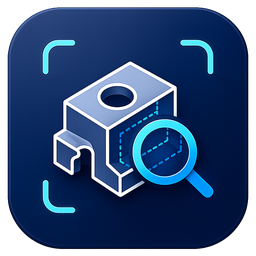

#  CADLens

전산응용기계제도기능사 실기 도면을 제출 전에 스스로 점검하는 서비스입니다.

DWG나 DXF 도면을 올리면 24개 항목을 자동으로 확인하고, 문제가 있는 위치를 도면 위에 번호로 찍어서 보여줍니다. 지적할 때마다 왜 틀렸는지와 어떻게 고치는지도 같이 알려줍니다.

**[CADLens 바로가기](https://naverogq.onrender.com)** · 한국어 / English / 日本語 / 中文 · 밝은 화면과 어두운 화면 지원

---

## 문제 정의

실기 시험은 **4시간 안에 도면을 다 그려서 그 자리에서 제출**합니다. 내고 나면 고칠 수 없습니다.

그런데 떨어지는 이유는 대부분 "그릴 줄 몰라서"가 아닙니다. 도면은 다 그렸는데 **표면거칠기 값을 안 적었거나, 기하공차에 데이텀을 빼먹었거나, 구멍에 지름 치수를 안 넣은** 경우입니다. 이 중 몇 가지는 감점도 아니고 바로 **오작(실격)** 입니다.

이런 실수가 혼자서는 잘 안 보이는 이유가 세 가지 있습니다.

1. **확인할 게 너무 많습니다.** 채점 항목이 7가지로 나뉘고, 그 안에서 봐야 할 세부 항목은 20개가 넘습니다.
2. **틀렸다고 말해주는 사람이 없습니다.** 혼자 연습하면 뭘 빠뜨렸는지 알 방법이 없습니다. 시험 결과도 합격인지 아닌지만 나옵니다.
3. **틀린 걸 모르고 하는 연습은 실수를 굳힙니다.** 틀린 채로 100장을 그리면 101장째도 똑같이 틀립니다.

그래서 **CADLens는 도면을 대신 그려주지 않습니다.** 내기 직전에 빠진 걸 찾아주고, 왜 틀렸는지 알려주는 것만 합니다. 혼자 연습하는 사람도 선생님 없이 `검사 → 고치기 → 다시 검사`를 반복할 수 있게 하는 게 목표입니다.

---

## 아키텍처


1. **도면을 올립니다.** 웹 화면에서 파일을 끌어다 놓으면 서버로 보냅니다.
2. **DWG면 DXF로 바꿉니다.** `dwg2dxf`로 변환한 뒤 읽습니다. 처음부터 DXF면 건너뜁니다. zip으로 올리면 압축을 풀고 안에서 도면을 찾습니다.
3. **도면에서 정보를 뽑습니다.** 치수 개수, 표면거칠기 기호, 기하공차의 데이텀, 표제란 내용 같은 것들입니다.
4. **채점합니다.** 90점 중 **60점은 규칙으로**, **30점은 AI로** 채점합니다. 실격 조건 5가지는 점수와 상관없이 따로 먼저 확인합니다.
5. **결과를 그림과 같이 돌려줍니다.** 도면을 그려서 문제 자리에 번호를 찍고, 지적 목록과 점수를 같이 보냅니다.

**왜 60점과 30점을 나눴나** — "표면거칠기 값이 비어 있다" 같은 건 답이 정해져 있어서 규칙이 더 빠르고 항상 같은 답을 냅니다. 반대로 "정면도를 잘 골랐나", "뷰가 균형 있게 놓였나"는 규칙으로 만들기 어려워서 이 부분만 AI에 맡겼습니다.

| 파일 | 하는 일 |
|---|---|
| `static/index.html` | 웹 화면 전체. HTML·CSS·JS가 이 파일 하나에 다 들어 있음 |
| `main.py` | 서버. 파일을 받고 결과를 돌려줌 |
| `check.py` | 읽기 → AI 채점 → 규칙 채점 순서를 이어주는 부분 |
| `dwg.py` | 도면 읽기. DWG 변환, 정보 뽑기, 도면 그림 그리기 |
| `exam.py` | 채점. 검사 규칙 24개와 배점표 |
| `ai_review.py` | AI에게 투상도 배열을 물어보는 부분 |
| `bench.py`, `test_rules.py` | 검사가 제대로 되는지 확인 |

웹 화면 쪽에는 React 같은 걸 안 썼습니다. 따로 빌드하는 과정 없이 파일 하나만 열면 되게 하고 싶었습니다.

**배점** — 투상도 선택과 배열 30점(AI) / 치수 15점 / 끼워맞춤·치수공차 10점 / 표면거칠기 10점 / 기하공차 10점 / 주서·표제란 8점 / 재료·열처리 7점, 합쳐서 90점. 각 항목이 어느 KS 규격에서 나왔는지는 [검사 항목과 근거](docs/rule_standards.md)에 정리했습니다.

---

## 사용 스택

| 어디에 | 무엇을 | 버전 | 라이선스 |
|---|---|---|---|
| 언어 | Python | 3.13 | PSF |
| 웹 서버 | FastAPI | 0.141.1 | MIT |
| 서버 실행 | Uvicorn | 0.52.0 | BSD-3-Clause |
| 파일 업로드 | python-multipart | 0.0.32 | Apache-2.0 |
| 도면 읽기 | ezdxf | 1.4.4 | MIT |
| 도면을 그림으로 | PyMuPDF | 1.28.0 | **AGPL-3.0** 또는 상용 |
| 이미지 처리 | Pillow | 12.3.0 | MIT-CMU |
| 인터넷 요청 | Requests | 2.34.2 | Apache-2.0 |
| Gemini 연결 | google-genai | 2.16.0 | Apache-2.0 |
| Claude 연결 | anthropic | 0.120.2 | MIT |
| DWG 변환 | GNU LibreDWG (`dwg2dxf`) | 0.14 | **GPL-3.0-or-later** |
| 웹 화면 | 그냥 HTML + CSS + JS | — | 프레임워크와 빌드 도구 없음 |
| 3D 로고 | three.js | — | MIT |
| 배포 | Docker + Render.com | — | — |

GPL과 AGPL을 어떻게 처리했는지는 [`NOTICE.md`](NOTICE.md)에 적어 뒀습니다.

---

## 실행 방법

**그냥 쓰려면 [naverogq.onrender.com](https://naverogq.onrender.com) 에 들어가면 됩니다.** 설치할 게 없습니다.

직접 돌려야 한다면(예: 학교에서 도면을 밖으로 안 내보내고 쓰고 싶을 때) Docker로 띄우면 됩니다.

```bash
git clone https://github.com/ritual1127/naverogq.git
cd naverogq
docker build -t cadlens .
docker run -p 7860:7860 cadlens          # AI 없이
docker run -p 7860:7860 -e GOOGLE_API_KEY=... cadlens   # AI까지
```

Dockerfile이 LibreDWG를 알아서 설치해서 DWG가 바로 열립니다. 빌드 마지막에 예제 DWG로 변환이 되는지 한 번 돌려보기 때문에, 변환이 깨진 상태로는 배포되지 않습니다.

| 환경 변수 | 꼭 필요한가 | 설명 |
|---|---|---|
| `GEMINI_API_KEY` 또는 `GOOGLE_API_KEY` | 아니요 | 넣으면 투상도 30점을 Gemini가 채점 |
| `ANTHROPIC_API_KEY` | 아니요 | Gemini 키가 없을 때 Claude가 채점 |
| `AI_PROVIDER` | 아니요 | `gemini` 또는 `claude`로 직접 지정 |

**AI 키를 안 넣어도 돌아갑니다.** 투상도 30점이 "사람 확인 필요"로 비워지고, 나머지 60점 검사와 실격 확인은 그대로 됩니다.

---

## 검사 내용

24개 항목을 봅니다. 결과는 실격 / 오류 / 경고 / 참고로 나눠서 보여주고, 번호를 누르면 도면에서 그 위치로 이동합니다.

| 무엇을 | 어떤 걸 확인하나 |
|---|---|
| 치수 (15점) | 치수가 하나도 없는지, 지름 치수가 없는 원·구멍이 있는지 |
| 끼워맞춤·치수공차 (10점) | H7·h6·js5 같은 끼워맞춤 기호가 있는지, 공차가 붙은 치수가 너무 적은지 |
| 표면거칠기 (10점) | 기호는 있는데 값이 비었는지, 한 종류만 써서 다듬질 구분이 없는지, 기호 수가 부족한지 |
| 기하공차 (10점) | 데이텀이 붙어 있는지, 공차값이 비었는지, 개수가 부족한지 |
| 주서·표제란 (8점) | 주서가 있는지, 일반공차·모떼기·열처리 같은 필수 문구가 빠졌는지, 표제란·도면양식이 있는지 |
| 재료·열처리 (7점) | 열처리·표면처리 지시가 있는지 |
| 투상도 (30점) | **점수는 AI가 매깁니다** — 정면도를 잘 골랐는지, 개수가 모자라거나 넘치는지, 제3각법 배치가 맞는지, 배치가 치우치지 않았는지. 여기에 더해 투상도 개수 부족, 중심선·중심마크 없음, 상세도·단면도 문자 표기 없음, 척도 표기 없음은 규칙으로도 잡습니다 |

**실격 조건 5가지**는 점수와 별도로 먼저 확인합니다. 표면거칠기 기호가 아예 없음 / 기하공차 기호가 아예 없음 / 투상법이 제3각법이 아님 / 도면 크기가 요구와 다름 / 표준에 없는 척도. 실제 판정은 그 회차의 공개문제와 지시사항을 우선합니다.

지원 형식은 DWG와 DXF고, 앞으로 ipt, idw, iam도 지원하려고 합니다.

> 항목 24개가 각각 **어느 KS 규격과 채점 기준에서 나왔는지**는 [검사 항목과 근거](docs/rule_standards.md)에서 보세요.

---

## 정확도

**답을 미리 정해 둔 연습용 도면**으로 잽니다. "치수를 일부러 빼놓은 도면"을 넣고 그걸 정확히 찾아내는지 보는 방식입니다.

| 연습용 도면 | 정확히 맞힘 | 찾아야 할 문제를 찾은 비율 | 없는 문제를 있다고 함 |
|---|---|---|---|
| 18장 | 18장 | 100% (17건 중 17건) | 0건 |

**이 100%가 실제 시험 도면에서도 100%라는 뜻은 아닙니다.** 저희가 직접 만든 도면이라 실제 수험생 도면보다 단순하고, 도면을 만든 사람과 검사 규칙을 만든 사람이 같습니다. 이 표가 보장하는 건 "18가지 상황에서 잡을 걸 잡는다"와 "멀쩡한 도면에 헛지적을 안 한다" 두 가지뿐입니다.

**아직 못 잡는 것도 알고 있습니다.**

- 표면거칠기 기호를 **문자로** 찾기 때문에, 선으로만 그리고 문자를 안 넣으면 못 봅니다.
- 기하공차도 마찬가지로, 기입틀을 선과 문자로 직접 그리면 못 봅니다.
- 중심선을 **레이어·선종류 이름으로** 찾기 때문에, 이름이 CENTER나 중심 계열이 아니면 못 셉니다.
- 윤곽선을 닫힌 사각형으로 찾아서, 선 4개로 그린 윤곽선은 못 봅니다.
- 순수 DXF는 뷰 경계를 알 수 없어서 투상도 개수·배치를 못 셀 때가 있습니다. 이럴 땐 "없다"고 하지 않고 검사를 건너뜁니다.
- 무엇보다 **라벨이 붙은 실제 수험생 도면 표본이 아직 없습니다.**

> 어떻게 쟀는지, 도면 18장이 각각 뭘 확인하는지, 남은 약점 표는 [검사 정확도](docs/accuracy.md)에서 보세요.

---

## 계속 고치고 있습니다

제출한 뒤로도 실제 도면을 계속 넣어 보면서 잘못된 걸 찾아 고치고 있습니다.

연습용 도면으로 확인해 보니 **DXF 도면은 거의 무조건 실격으로 나오고 있었습니다.** 도면에 분명히 있는 거칠기 기호, 기하공차, 중심선, 투상도, 표제란을 전부 못 읽고 "없다"고 판단했습니다. 지금은 전부 읽고, **알 수 없는 항목은 "없다"고 단정하지 않고 검사를 건너뜁니다.**

특히 위험했던 건 **실격인 도면을 통과시키던 문제**였습니다. 방향 표시로 쓰는 `X`, `Y`, `Z` 글자를 거칠기 기호로 착각해서, 기호가 하나도 없는 도면을 통과시켰습니다. 잘못 지적하는 것보다 **실격을 놓치는 쪽이 더 위험**해서 먼저 고쳤습니다.

기능도 계속 붙이고 있습니다. **다시 검사해서 비교하기**(고쳐서 다시 올리면 `고쳐짐 / 그대로 / 새로 생김`과 점수 변화를 보여줌), 지적한 곳으로 바로 이동, 도면 확대·이동, 어두운 화면.

> 무엇이 왜 틀렸고 어떻게 고쳤는지는 [검사 정확도](docs/accuracy.md)의 `측정으로 잡은 문제`에서 보세요. 앞으로 뭘 할지는 [발전 계획](docs/roadmap.md)에 있습니다.

---

## 임팩트 — 지표 · 사회적 가치 · 사업화

**사용자 수는 아직 세지 않습니다.** 사람을 모으는 것보다 먼저 고칠 게 남았다고 봤습니다. 실제 수험생 도면으로 정확도를 다시 재고 AI 점수 편차를 줄인 다음, 그때부터 집계하려고 합니다. 집계하더라도 쓰는 사람 대부분이 미성년자라 개인을 알아볼 수 있는 정보는 빼고 최소한만 모을 생각입니다.

대신 **실제로 측정한 것**은 이렇습니다 — 검사 항목 24개, 기준 도면 18장 중 18장 일치, 문제를 찾은 비율 100%(17건 중 17건), 헛지적 0건, 코드를 고칠 때마다 자동 테스트 실행.

**이 문제를 겪는 사람**은 매년 1만 명이 필기를, 3천 명 넘게 실기를 봅니다. 실기 합격률이 5년째 45~53%라 **매년 1,500명 정도가 떨어지고**, 상당수는 그리는 실력이 아니라 표기를 빠뜨려서 떨어집니다.

**하고 싶은 건 하나입니다. 혼자 연습하는 사람도 피드백을 받게 하는 것.** 학원에 못 다녀도 무료로 쓸 수 있고, 선생님이 반복하는 확인을 줄여주고, 붙었는지만 알려주는 채점을 `왜 틀렸고 어떻게 고치는지`로 바꾸는 겁니다.

**사업은 아직 구조가 없고 매출도 없습니다.** 가장 현실적인 건 학교에 파는 방식입니다. 반 단위 화면을 만들어 선생님 채점 시간을 줄여주는 대가로 계약하는 건데, 미성년자한테 직접 결제를 붙이지 않아도 된다는 점에서도 낫습니다. 다만 정확도 검증과 AI 점수 편차를 해결하기 전에는 팔 수 없습니다.

> 지표 상세, 응시자 통계 원본과 출처, 사회적 가치 5가지, 수익 모델 4가지와 해결 과제는 [임팩트 상세](docs/impact.md)에서 보세요.

---

## 공개 고지 — 개인정보 · AI 생성물 · 미성년자 안전 · 저작권

**개인정보** — 회원가입도 로그인도 없고 이름·연락처를 받지 않습니다. 쿠키와 추적 코드가 없습니다. 올린 도면은 그 검사에만 쓰고 **최대 1시간** 뒤 서버에서 지웁니다. AI 학습에 쓰거나 팔지 않습니다. 다만 **투상도 30점을 채점할 때 도면을 그림으로 바꿔 Google Gemini에 보냅니다**(원본 파일은 안 보냄). 도면 표제란에 이름이 있으면 결과 화면에 뜨니 **지우고 올리세요.**

**AI 생성물 표기** — 90점 중 **투상도 30점과 "AI 총평" 문장만 AI(Gemini 또는 Claude)가 만듭니다.** 나머지 60점과 실격 판정은 AI를 전혀 안 쓰는 규칙 코드입니다. 화면에서 AI가 매긴 항목엔 `AI` 표시가 붙습니다. AI 점수는 매번 똑같이 안 나오니 확정 점수가 아닙니다. 코드와 문서도 AI 도구로 썼고 전부 사람이 확인한 뒤 넣었습니다.

**미성년자 안전** — 개인정보 입력란, 결제, 광고, 추적 코드가 없습니다. 채팅·댓글·프로필처럼 사용자끼리 만날 수 있는 기능이 아예 없습니다. AI는 도면 채점 역할로 고정돼 있고 정해진 형식의 답만 화면에 나옵니다. 학교에서는 Docker로 AI 키 없이 띄우면 도면이 밖으로 안 나갑니다.

**저작권** — 도면 저작권은 그린 사람 것입니다. 검사 기준은 KS 규격과 공개된 채점 기준만 보고 만들었고 **비공개 채점표를 베낀 적이 없습니다.** CADLens는 공식 채점이 아니고 한국산업인력공단·Q-Net과 아무 관계가 없습니다. 코드는 MIT이고, LibreDWG(GPL-3.0)와 PyMuPDF(AGPL-3.0) 취급은 [`NOTICE.md`](NOTICE.md)에 있습니다.

**주의** — CADLens는 마지막에 확인하는 걸 도와주는 보조 도구입니다. 제출 전에는 꼭 그 회차의 공개문제와 감독위원 지시사항을 같이 확인하세요.

> 네 항목 전문은 [공개 고지 상세](docs/policy.md)에서 보세요. 같은 내용을 웹 화면 맨 아래에서 한국어·영어·일본어·중국어로도 볼 수 있습니다.

---

## AI·오픈소스·외부 자문 공개

**사용한 AI 모델**

| 모델 | 만든 곳 | 어디에 썼나 |
|---|---|---|
| Gemini (`gemini-3.6-flash`) | Google | **서비스가 돌아갈 때** — 투상도 30점 채점 (공개 서버 기본값) |
| Claude Opus 5 (`claude-opus-5`) | Anthropic | **서비스가 돌아갈 때** — Gemini 키가 없으면 대신 채점 |
| Claude Opus 5 / Sonnet 5 / Sonnet 4.8 | Anthropic | 만들 때 — 코드 작성·정리, 문서와 번역 초안 (Claude Code) |
| GPT-5.6 Sol | OpenAI | 만들 때 — 코드 작성 도움 |

**사용한 오픈소스** — 서버는 ezdxf 1.4.4(MIT), Pillow 12.3.0(MIT-CMU), FastAPI 0.141.1(MIT), Uvicorn 0.52.0(BSD-3-Clause), python-multipart 0.0.32(Apache-2.0), Requests 2.34.2(Apache-2.0), PyMuPDF 1.28.0(**AGPL-3.0**/상용), google-genai 2.16.0(Apache-2.0), anthropic 0.120.2(MIT). 브라우저에서는 three.js(MIT)를 외부에서 안 불러오고 직접 올려서 씁니다. 따로 설치해야 하는 건 GNU LibreDWG `dwg2dxf` 0.14(**GPL-3.0-or-later**, DWG 변환), ODA File Converter(상용 무료, 변환 대체용), Autodesk Inventor(상용, ipt/idw/iam 읽기)입니다. 개발할 때만 pytest(MIT)와 fontTools(MIT)를 씁니다. 라이선스를 어떻게 처리했는지는 [`NOTICE.md`](NOTICE.md)에 더 자세히 있습니다.

**외부 자문** — **구미전자공업고등학교 김민정 선생님**께 실기 채점 항목을 수업에서 어떻게 확인하시는지, 학생들이 실제로 자주 틀리는 게 뭔지 자문을 받았습니다. 들은 내용은 검사 항목을 고르고 지적 문구를 쓰는 데 반영했습니다. 도와주신 분이 이 프로젝트 결과에 책임을 지시는 건 아닙니다.

---

## 라이선스

프로젝트 코드와 문서는 **MIT 라이선스**([`LICENSE`](LICENSE))입니다. 남의 프로그램은 [`NOTICE.md`](NOTICE.md)를 참고하세요(특히 LibreDWG는 GPL-3.0, PyMuPDF는 AGPL-3.0). **사용자가 올린 도면의 저작권은 올린 사람 것이고 이 라이선스와 상관없습니다.**
