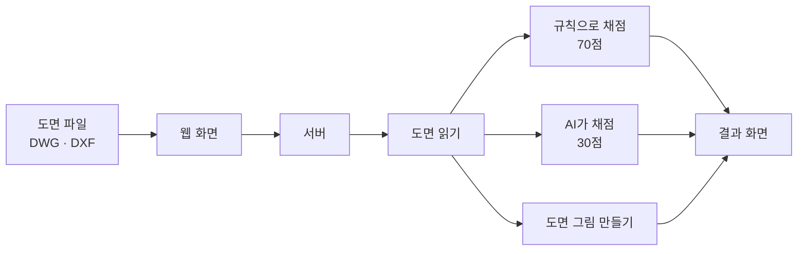

#  CADLens

전산응용기계제도기능사 실기 도면을 제출 전에 스스로 점검하는 서비스입니다.

DWG나 DXF 도면을 올리면 37개 항목을 자동으로 확인하고, 문제가 있는 위치를 도면 위에 번호로 찍어서 보여줍니다. 지적할 때마다 왜 틀렸는지와 어떻게 고치는지도 같이 알려줍니다.

**[CADLens 바로가기](https://naverogq.onrender.com)** · 한국어 / English / 日本語 / 中文 · 밝은 화면과 어두운 화면 지원

> **미션** — 우리는 전산응용기계제도기능사 실기를 혼자 준비하는 수험생이 도면을 제출하기 직전에 겪는,
> 혼자 볼 때는 무엇을 빠뜨렸는지 짚어 줄 사람이 없고 남이 짚어 줘도 그때는 고칠 시간이 없는 문제를,
> 도면 파일을 올리면 빠진 항목을 도면 위에 찍어 주는 웹 검사기로 없앤다. (2026-08-30 인터뷰 5건으로 고침)
>
> **북극성 지표** — 주간 재검사 사용자 수(도면을 고쳐서 다시 올린 사람). 오늘 0명 → 8주 뒤 주 20명.
> 왜 이 지표인지는 [팀 목표 1장](plan/w1/팀목표.md)에 있습니다.

---

## 문제 정의

실기 시험은 **5시간 안에 도면을 다 그려서 그 자리에서 제출**합니다. 내고 나면 고칠 수 없습니다.

그런데 떨어지는 이유는 대부분 "그릴 줄 몰라서"가 아닙니다. 도면은 다 그렸는데 **표면거칠기 값을 안 적었거나, 기하공차에 데이텀을 빼먹었거나, 구멍에 지름 치수를 안 넣은** 경우입니다. 이 중 몇 가지는 감점도 아니고 바로 **오작(실격)** 입니다.

이런 실수가 혼자서는 잘 안 보이는 이유가 세 가지 있습니다.

1. **확인할 게 너무 많습니다.** 채점 항목이 8가지로 나뉘고, 그 안에서 봐야 할 세부 항목은 20개가 넘습니다.
2. **틀렸다고 말해주는 사람이 없습니다.** 혼자 연습하면 뭘 빠뜨렸는지 알 방법이 없습니다. 시험 결과도 합격인지 아닌지만 나옵니다.
3. **틀린 걸 모르고 하는 연습은 실수를 굳힙니다.** 틀린 채로 100장을 그리면 101장째도 똑같이 틀립니다.

그래서 **CADLens는 도면을 대신 그려주지 않습니다.** 내기 직전에 빠진 걸 찾아주고, 왜 틀렸는지 알려주는 것만 합니다. 혼자 연습하는 사람도 선생님 없이 `검사 → 고치기 → 다시 검사`를 반복할 수 있게 하는 게 목표입니다.

> 이 문제를 직접 겪고 만들게 된 이야기는 [왜 만들었나](docs/왜_만들었나.md)에 있습니다.

---

## 아키텍처

1. **도면을 올립니다.** 웹 화면에서 파일을 끌어다 놓으면 서버로 보냅니다.
2. **DWG면 DXF로 바꿉니다.** `dwg2dxf`(LibreDWG)를 먼저 쓰고, 없으면 CloudConvert, 그다음 ODA File Converter 순으로 넘어갑니다. 셋 다 없으면 "DXF로 내보내서 올려 달라"고 안내합니다. 처음부터 DXF면 건너뜁니다. zip으로 올리면 압축을 풀고 안에서 도면을 찾습니다.
3. **도면에서 정보를 뽑습니다.** 치수 개수, 표면거칠기 기호, 기하공차의 데이텀, 표제란 내용 같은 것들입니다.
4. **채점합니다.** 100점 중 **70점은 규칙으로**, **30점은 AI로** 채점합니다. 실격 조건 6가지는 점수와 상관없이 따로 먼저 확인합니다.
5. **결과를 그림과 같이 돌려줍니다.** 도면을 그려서 문제 자리에 번호를 찍고, 지적 목록과 점수를 같이 보냅니다.

**왜 70점과 30점을 나눴나** — "표면거칠기 값이 비어 있다" 같은 건 답이 정해져 있어서 규칙이 더 빠르고 항상 같은 답을 냅니다. 문제는 나머지입니다. **"정면도를 잘 골랐나", "뷰가 균형 있게 놓였나"는 정답을 조건식으로 적을 수가 없습니다.** 도면을 눈으로 보고 판단해야 하는 영역이고, 실기에서 배점이 가장 큰 항목(30점)이 하필 여기입니다. 규칙 코드로는 이 30점을 아예 채점할 수 없어서, **도면을 그림으로 만들어 멀티모달 AI에게 채점위원 기준으로 보여주는 방식**을 썼습니다. 70점은 규칙이 잘하는 일이고, 30점은 AI가 아니면 못 하는 일입니다.

| 파일 | 하는 일 |
|---|---|
| `static/index.html` · `home.js` | 웹 첫 화면과 검사 결과 화면 |
| `static/ks.html` · `ks.js` | KS 기준 페이지(`/ks`). 검사마다 근거 규격 |
| `static/accuracy.html` · `accuracy.js` | 정확도 페이지(`/accuracy`). 측정 결과와 한계 |
| `static/common.js` · `site.css` | 세 페이지가 같이 쓰는 머리글·바닥글·번역·화면 설정과 스타일 |
| `main.py` | 서버. 파일을 받고 결과를 돌려줌 |
| `check.py` | 읽기 → AI 채점 → 규칙 채점 순서를 이어주는 부분 |
| `dwg.py` | 도면 읽기. DWG 변환, 정보 뽑기, 도면 그림 그리기 |
| `exam.py` | 채점. 검사 규칙 37개와 배점표 |
| `ai_review.py` | AI에게 투상도 배열을 물어보는 부분 |
| `bench.py`, `test_rules.py` | 검사가 제대로 되는지 확인 (자동 테스트 43개 · 기준 도면 25장 · 합성 도면 100장) |
| `variance.py` | 같은 도면을 여러 번 채점해 AI 점수가 몇 점 흔들리는지 측정 |
| `example/` | 다른 국가기술자격으로 넓힐 수 있는지 따져 본 조사 기록 (코드 아님) |

웹 화면 쪽에는 React 같은 걸 안 썼습니다. 따로 빌드하는 과정 없이 파일 하나만 열면 되게 하고 싶었습니다.

**배점** — 공개된 채점 기준표의 8개 항목을 그대로 씁니다. 투상도 선택과 배열 30점(AI) / 치수 15점 / 끼워맞춤·치수공차 10점 / 표면거칠기 10점 / 기하공차 10점 / **도면 배치와 외관 10점** / 주서·표제란 8점 / 재료·열처리 7점, 합쳐서 **100점**. `도면 배치와 외관`은 오래 빠져 있어서 만점이 90점이었고, 선 굵기·문자 크기처럼 DXF에서 바로 읽히는 항목이 채점되지 않고 있었습니다. 각 항목이 어느 KS 규격에서 나왔는지는 [검사 항목과 근거](docs/rule_standards.md)에 정리했습니다.

---

## 사용 스택

| 어디에 | 무엇을 | 버전 | 라이선스 |
|---|---|---|---|
| 언어 | Python | 3.13 | PSF |
| 웹 서버 | FastAPI | 0.141.1 | MIT |
| 서버 실행 | Uvicorn | 0.52.0 | BSD-3-Clause |
| 파일 업로드 | python-multipart | 0.0.32 | Apache-2.0 |
| 도면 읽기 | ezdxf | 1.4.4 | MIT |
| 도면을 그림으로 | PyMuPDF | 1.28.0 | **AGPL-3.0** 또는 상용 |
| 이미지 처리 | Pillow | 12.3.0 | MIT-CMU |
| 인터넷 요청 | Requests | 2.34.2 | Apache-2.0 |
| Gemini 연결 | google-genai | 2.16.0 | Apache-2.0 |
| Cloudflare · Mistral · Groq 연결 | Requests (REST 직접 호출, 전용 SDK 없음) | 2.34.2 | Apache-2.0 |
| DWG 변환 | GNU LibreDWG (`dwg2dxf`) | 0.14 | **GPL-3.0-or-later** |
| 웹 화면 | 그냥 HTML + CSS + JS | — | 프레임워크와 빌드 도구 없음 |
| 화면 글꼴 | 나눔스퀘어라운드 (서버에 직접 올림) | — | SIL OFL 1.1 |
| 캐릭터 스티커 | OGQ마켓 API (대회 제공) · 「박하의 힐링타임」 | — | 대회 참여 목적으로만 사용, 저장소에 파일 없음 |
| 배포 | Docker + Render.com | — | — |

GPL과 AGPL을 어떻게 처리했는지는 [`NOTICE.md`](NOTICE.md)에 적어 뒀습니다.

---

## 쓰는 방법

**[naverogq.onrender.com](https://naverogq.onrender.com) 에 들어가면 됩니다.** 회원가입도 설치도 없습니다. 도면을 끌어다 놓으면 끝입니다.

### AI 채점기를 두 곳으로 붙여 둔 이유

배점이 가장 큰 투상도 30점을 AI가 채점하므로, **AI가 멈추면 채점의 3분의 1이 멈춥니다.** 무료로 계속 열어 두려면 한쪽 할당량이 끊겨도 서비스가 버텨야 합니다.

| 순서 | 채점기 | 모델 | 무료 한도 |
|---|---|---|---|
| 1 | Google Gemini | `gemini-3.6-flash` | 공개 서버 기본값 |
| 2 | Cloudflare Workers AI | `@cf/meta/llama-4-scout-17b-16e-instruct` | 계정당 일일 뉴런 |
| 3 | Mistral | `mistral-small-latest` | 월 10억 토큰 |
| 4 | Groq | `qwen/qwen3.6-27b` | 일 1,000 요청 · 분당 8,000 토큰 |

네 경로가 **같은 프롬프트와 같은 JSON 스키마**를 쓰기 때문에 어느 쪽이 채점해도 결과 형식이 달라지지 않습니다. 같은 도면을 같은 모델로 다시 검사하면 저장해 둔 응답을 써서 API를 다시 부르지 않습니다.

**지적을 받고 나서 생기는 물음에도 답합니다.** 감점 문구만 보고 "이게 왜 감점이지" 하고 막히면 고칠 수가 없습니다. 그래서 AI가 매긴 지적마다 `왜 감점이야?` · `어디를 눌러?` · `고친 뒤 확인은?` 세 개의 답을 **채점 직후 이어서 만들어 둡니다.** 이 답과 번역을 만드는 호출이 채점 호출보다 두 배 넘게 걸려서(실측 13초 대 5초), 점수와 지적은 먼저 보여 주고 답과 번역은 몇 초 뒤 화면에 채웁니다. 채워진 뒤에는 버튼을 누르면 바로 펼쳐지고, 서버를 다시 부르지 않습니다.

자유 입력란은 두지 않았습니다. 주 사용자가 미성년자라 AI를 도면 채점 역할에 묶어 두는 편이 안전하고, 정해진 질문만 쓰면 답을 미리 만들어 캐시에 넣을 수 있어 무료 할당량도 아낍니다.

AI가 매긴 지적과 총평, 그리고 이 세 가지 답은 **영어·일본어·중국어로도 보여줍니다.** 도면마다 문장이 달라 고정 번역표를 쓸 수 없으므로, 채점 결과를 한 번 더 넘겨 세 언어를 받아 같은 캐시에 넣습니다. Groq는 분당 토큰 한도가 8,000이라 채점만으로 한도를 채워 번역까지는 가지 못할 때가 많은데, 그때는 항목 이름과 일반 안내로 표시합니다.

네 경로가 다 막히면 **투상도 30점이 "사람 확인 필요"로 비워지고**, 화면에도 AI가 꺼져 있다고 표시됩니다. 규칙 70점과 실격 확인은 그대로 돌아가지만 배점이 가장 큰 항목이 빠진 상태이므로, 없는 점수를 있는 것처럼 채우지 않습니다.

---

## 검사 내용

37개 항목을 봅니다. 결과는 실격 / 오류 / 경고 / 참고로 나눠서 보여주고, 번호를 누르면 도면에서 그 위치로 이동합니다.

| 무엇을 | 어떤 걸 확인하나 |
|---|---|
| 치수 (15점) | 치수가 하나도 없는지, 지름 치수가 없는 원·구멍이 있는지. **치수는 도면 전체에서 한 번만 적으면 됩니다** — 우측면도에 없어도 정면도에 있으면 기입한 것으로 봅니다 |
| 끼워맞춤·치수공차 (10점) | H7·h6·js5 같은 끼워맞춤 기호가 있는지, 공차가 붙은 치수가 너무 적은지 |
| 표면거칠기 (10점) | 기호는 있는데 값이 비었는지, 한 종류만 써서 다듬질 구분이 없는지, 기호 수가 부족한지, **다듬질 구분을 정의하는 비교표가 있는지** |
| 기하공차 (10점) | 데이텀이 붙어 있는지, 공차값이 비었는지, 개수가 부족한지 |
| 주서·표제란 (8점) | 주서가 있는지, 일반공차·모떼기·열처리 같은 필수 문구가 빠졌는지, 표제란·도면양식이 있는지, **기어·스프링이 있는데 요목표가 빠졌는지** |
| **도면 배치와 외관 (10점)** | **용도에 맞게 선 굵기를 구분했는지(KS는 가는 선 : 굵은 선 = 1 : 2 이상), 치수 문자가 KS 호칭 크기이고 읽을 만한지** |
| 재료·열처리 (7점) | 열처리·표면처리 지시가 있는지, 부품란에 재료 기호가 있는지, 3D 등각투상도라면 부품란 비고에 질량(g)이 있는지 |
| 도면 양식 | 도면 영역이 요구 크기(A2)인지, 표제란에 척도·각법 표기가 있는지, 부품도 척도가 1:1인지, 뷰 하나만 척도가 다르지 않은지 |
| 투상도 (30점) | **점수는 AI가 매깁니다** — 정면도를 잘 골랐는지, 개수가 모자라거나 넘치는지, 제3각법 배치가 맞는지, 배치가 치우치지 않았는지. 지적을 펼치면 `왜 감점이야?` · `어디를 눌러?` · `고친 뒤 확인은?` 세 가지를 눌러 볼 수 있습니다. 여기에 더해 **제3각법 배치는 뷰 좌표로 직접 판정**하고(정면도 기준으로 평면도가 위·우측면도가 오른쪽인지), 투상도 개수 부족, 중심선·중심마크 없음, 상세도·단면도 문자 표기 없음, 척도 표기 없음은 규칙으로도 잡습니다 |

**실격 조건 6가지**는 점수와 별도로 먼저 확인합니다. 표면거칠기 기호가 아예 없음 / 기하공차 기호가 아예 없음 / **끼워맞춤 공차 기호가 아예 없음** / 투상법이 제3각법이 아님 / 도면 크기가 요구와 다름 / 표준에 없는 척도. 공개된 수험자 유의사항의 오작 9가지 중 DXF로 판정할 수 있는 것들입니다. 요구 도면 영역은 공개문제 기준 **A2**이고, A3는 출력 크기라 오작이 아니라 경고로 둡니다. 실제 판정은 그 회차의 공개문제와 지시사항을 우선합니다.

지원 형식은 DWG와 DXF입니다. Inventor 원본(ipt · idw · iam)은 공개된 형식이 아니라 서버에서 못 읽습니다. 올리면 무슨 파일인지 알아보고 `파일 > 내보내기 > DWG/DXF` 절차를 알려 줍니다. 왜 그렇게 했는지와 Inventor 도면에서 무엇이 읽히는지는 [Inventor 정리](docs/inventor.md)에 있습니다.

> 항목이 각각 **어느 KS 규격과 채점 기준에서 나왔는지**는 [검사 항목과 근거](docs/rule_standards.md)에서 보세요.

---

## 정확도

**답을 미리 정해 둔 도면**으로 잽니다. "치수를 일부러 빼놓은 도면"을 넣고 그걸 정확히 찾아내는지 보는 방식입니다. **우리가 만든 도면과 남의 도면, 두 숫자를 나란히 둡니다.**

| 어떤 도면 | 정확히 맞힘 | 찾아야 할 문제를 찾은 비율 | 없는 문제를 있다고 함 |
|---|---|---|---|
| 우리가 만든 기준 도면 25장 | 25장 (100%) | 100% (23건 중 23건) | 0건 |
| 우리가 만든 합성 도면 100장 | 100장 (100%) | 100% (105건 중 105건) | 0건 |
| **학생에게 받은 실제 도면 23장** | **23장 (100%)** | **100% (63건 중 63건)** | **0건** |

실제 도면은 기계과 학생에게 받은 Inventor 도면(`.idw`) 32장을 DXF로 내보낸 것입니다. 중복 저장본을 빼면 서로 다른 23장입니다. **정답은 도면 그림을 눈으로 보고 달았고, CADLens 결과를 정답으로 쓰지 않았습니다.** 도면 파일은 남의 것이라 저장소에 올리지 않고, 파일 이름과 정답만 올립니다.

**이 100%도 그대로 믿으면 안 됩니다.**

- **표본이 한 학생 것입니다.** 23장 중 20장이 거칠기 기호도 기하공차도 없는 작업 중간 상태였고, 23장 모두 주서가 없었습니다. 그래서 주로 잰 것은 "**없는 것을 없다고 하는가**" 이고, "있는 것을 있다고 보는가"는 기호가 들어 있는 3장에서만 확인됐습니다.
- **검사 37개 중 6개만 라벨을 달았습니다.** 그림만 보고 확실히 가릴 수 있는 것(기호 유무·치수 유무·주서 유무·표제란 유무)으로 한정했습니다. 개수를 세야 하는 항목은 그림만으로 정답을 달 수 없어 뺐습니다.
- 정답을 단 사람은 **수험생 본인도 선생님도 아닙니다.**

**일부러 채점하지 않는 것도 있습니다.** 제도 기본에 어긋나거나 도면만으로 판정할 수 없는 것입니다.

- **뷰마다 치수가 붙었는지는 안 봅니다.** KS B 0001은 "하나의 치수는 도면 내 단 한 곳에만 기입한다"가 기본이고, 치수는 주 투상도(정면도)에 모으라고 합니다. 우측면도에 치수가 없어도 그 형상의 치수가 정면도에 있으면 기입한 것입니다.
- **윤곽선 밖에 남은 요소는 안 봅니다.** 채점은 도면 영역 안에서 이뤄지고, 틀 밖은 제출물의 일부가 아닙니다.
- **색으로 선 굵기를 주는 도면은 굵기를 판정하지 않습니다.** 출력 펜 설정으로 굵기를 내는 방식이라 DXF에 굵기가 없고, "굵기를 안 정했다"와 구별할 수 없습니다.
- **각 부품의 균형 배치(5점)는 AI에게 맡깁니다.** 치우침을 재 보니 표제란이 오른쪽 아래를 차지해 멀쩡한 도면이 전부 왼쪽으로 치우쳐 나왔습니다.

**아직 못 잡는 것도 알고 있습니다.**

- 표면거칠기 기호를 **문자로** 찾기 때문에, 선으로만 그리고 문자를 안 넣으면 못 봅니다. (실제 도면 23장에서는 학생이 √를 선으로 그리면서 다듬질 문자를 늘 같이 적어서 놓친 경우가 없었습니다.)
- 기하공차도 마찬가지로, 기입틀을 선과 문자로 직접 그리면 못 봅니다.
- 중심선을 **레이어·선종류 이름으로** 찾기 때문에, 이름이 CENTER나 중심 계열이 아니면 못 셉니다.
- **요목표를 안 읽습니다.** 스퍼기어 요목표의 `다듬질 방법` 칸을 주서로 세는 바람에 실제 도면 1장에서 "주서 없음"을 놓쳤습니다.
- 순수 DXF는 뷰 경계를 알 수 없어서 투상도 개수·배치를 못 셀 때가 있습니다. 이럴 땐 "없다"고 하지 않고 검사를 건너뜁니다.

> 어떻게 쟀는지, 도면이 각각 뭘 확인하는지, 남은 약점 표는 [검사 정확도](docs/accuracy.md)에서 보세요.

---

## 계속 고치고 있습니다

제출한 뒤로도 실제 도면을 계속 넣어 보면서 잘못된 걸 찾아 고치고 있습니다.

연습용 도면으로 확인해 보니 **DXF 도면은 거의 무조건 실격으로 나오고 있었습니다.** 도면에 분명히 있는 거칠기 기호, 기하공차, 중심선, 투상도, 표제란을 전부 못 읽고 "없다"고 판단했습니다. 지금은 전부 읽고, **알 수 없는 항목은 "없다"고 단정하지 않고 검사를 건너뜁니다.**

특히 위험했던 건 **실격인 도면을 통과시키던 문제**였습니다. 방향 표시로 쓰는 `X`, `Y`, `Z` 글자를 거칠기 기호로 착각해서, 기호가 하나도 없는 도면을 통과시켰습니다. 잘못 지적하는 것보다 **실격을 놓치는 쪽이 더 위험**해서 먼저 고쳤습니다.

**학생 도면 23장이 들어오자 세 가지가 더 드러났습니다**(2026-09-11).

1. **AI 는 도면의 절반만 보고 있었습니다.** 투상도 30점을 채점할 그림을 406mm로 잘라 보내고 있었는데, 요구 도면 영역인 A2가 594mm라 실제 도면이 전부 걸렸습니다. AI가 받은 그림은 도면 넓이의 **29~51%**였고 잘려 나간 쪽에 표제란과 투상도가 있었습니다. 지금은 자르지 않고 해상도를 낮춥니다.
2. **윤곽선을 한 장도 못 찾고 있었습니다.** 실기 도면의 윤곽선은 닫힌 사각형이 아니라 **선 네 개**입니다. 그래서 모든 도면에 "표제란·도면양식 없음"이 뜨고, 도면 크기를 아예 재지 않아 A2 요구 판정이 빠져 있었습니다.
3. **주서가 없는 도면 8장에서 "주서 없음"을 놓쳤습니다.** Inventor가 붙이는 뷰 이름표 `A-A ( 1 : 1 ) / .` 를 주서로 세고 있었습니다.

기능도 계속 붙이고 있습니다. **다시 검사해서 비교하기**(고쳐서 다시 올리면 `고쳐짐 / 그대로 / 새로 생김`과 점수 변화를 보여줌), 지적한 곳으로 바로 이동, 도면 확대·이동, 어두운 화면.

**다른 종목으로 넓힐 수 있는지도 미리 따져 봤습니다.** 기능사 한 종목만 지원하면 쓸 수 있는 사람이 제한되기 때문입니다. `exam.py`의 판정 함수 8개와 루브릭 7개를 기계설계산업기사·일반기계기사·사출금형산업기사·프레스금형산업기사의 출제기준에 하나씩 대보고 **그대로 / 상수만 조정 / 신규 개발**로 나눠 봤더니, 재사용률이 종목별로 50~90%였습니다. 코드를 건드리기 전에 근거부터 남긴 것이라 **아직 구현은 하지 않았습니다.**

> 종목별 재사용률과 도입 순서, 응시자 통계, 남은 공백은 [`example/`](example/)에 있습니다.

> 무엇이 왜 틀렸고 어떻게 고쳤는지는 [검사 정확도](docs/accuracy.md)의 `측정으로 잡은 문제`에서 보세요. 앞으로 뭘 할지는 [발전 계획](docs/roadmap.md)에 있습니다.

---

## 임팩트 — 지표 · 사회적 가치 · 사업화

**사용자 수는 아직 세지 않습니다.** 사람을 모으는 것보다 먼저 고칠 게 남았다고 봤습니다. 실제 수험생 도면으로 정확도를 다시 재고 AI 점수 편차를 줄인 다음, 그때부터 집계하려고 합니다. 집계하더라도 쓰는 사람 대부분이 미성년자라 개인을 알아볼 수 있는 정보는 빼고 최소한만 모을 생각입니다.

대신 **실제로 측정한 것**은 이렇습니다 — 검사 항목 37개, 우리가 만든 기준 도면 25장과 합성 도면 100장 모두 100% 일치, **학생에게 받은 실제 도면 23장 중 23장 일치·문제를 찾은 비율 100%·헛지적 0건**, 코드를 고칠 때마다 자동 테스트 43개 실행.

**이 문제를 겪는 사람**은 매년 1만 명이 필기를, 3천 명 넘게 실기를 봅니다. 실기 합격률이 5년째 45~53%라 **최근 3년만 봐도 매년 1,500~1,700명이 떨어지고**(2021년까지 넣으면 연평균 1,900명), 상당수는 그리는 실력이 아니라 표기를 빠뜨려서 떨어집니다. 연도별 응시·합격 숫자와 출처는 [응시자 통계](example/96_응시자_통계.md)에 정리했습니다.

**하고 싶은 건 하나입니다. 혼자 연습하는 사람도 피드백을 받게 하는 것.** 학원에 못 다녀도 무료로 쓸 수 있고, 선생님이 반복하는 확인을 줄여주고, 붙었는지만 알려주는 채점을 `왜 틀렸고 어떻게 고치는지`로 바꾸는 겁니다.

**사업은 아직 구조가 없고 매출도 없습니다.** 가장 현실적인 건 학교에 파는 방식입니다. 반 단위 화면을 만들어 선생님 채점 시간을 줄여주는 대가로 계약하는 건데, 미성년자한테 직접 결제를 붙이지 않아도 된다는 점에서도 낫습니다. 다만 정확도 검증과 AI 점수 편차를 해결하기 전에는 팔 수 없습니다.

> 지표 상세, 응시자 통계 원본과 출처, 사회적 가치 5가지, 수익 모델 4가지와 해결 과제는 [임팩트 상세](docs/impact.md)에서 보세요.

---

## 공개 고지 — 개인정보 · AI 생성물 · 미성년자 안전 · 저작권

**개인정보** — 회원가입도 로그인도 없고 이름·연락처를 받지 않습니다. 쿠키와 남의 추적 코드가 없습니다. 접속 수와 검사 횟수는 저희 서버가 직접 세서 화면 아래 "사용 현황"에 공개합니다 — IP 는 그 주에만 쓰는 값과 함께 해시한 16자만 남기고 원본은 저장하지 않습니다([자세히](docs/policy.md#개인정보-처리)). 올린 도면은 그 검사에만 쓰고 **최대 1시간** 뒤 서버에서 지웁니다. AI 학습에 쓰거나 팔지 않습니다. 다만 **투상도 30점을 채점할 때 도면을 그림으로 바꿔 Google Gemini에 보냅니다**(Gemini 가 막히면 Cloudflare Workers AI, Mistral, Groq 순으로 갑니다. 어느 쪽이든 원본 파일은 안 보냄). 도면 표제란에 이름이 있으면 결과 화면에 뜨니 **지우고 올리세요.**

DWG를 DXF로 바꾸는 일은 **서버 안에 설치된 LibreDWG**가 합니다. 변환을 위해 도면을 외부로 보내지 않습니다.

**AI 생성물 표기** — 100점 중 **투상도 30점과 "AI 총평" 문장을 AI(Gemini · Cloudflare Workers AI · Mistral · Groq 중 한 곳)가 만듭니다.** 배점이 가장 큰 항목이고, 규칙 코드로는 채점이 안 되는 부분입니다. 나머지 70점과 실격 판정은 규칙 코드가 맡습니다. 화면에서 AI가 매긴 항목엔 `AI` 표시가 붙습니다. 지적마다 붙는 질문 버튼 세 개의 답도 채점할 때 AI가 같이 만든 것이며, 미리 만들어 둔 고정된 답이라 사용자가 새로 물어볼 수는 없습니다. AI 점수는 매번 똑같이 안 나오니 확정 점수가 아닙니다. 코드와 문서도 AI 도구로 썼고 전부 사람이 확인한 뒤 넣었습니다.

**미성년자 안전** — 개인정보 입력란, 결제, 광고, 추적 코드가 없습니다. 채팅·댓글·프로필처럼 사용자끼리 만날 수 있는 기능이 아예 없습니다. AI는 도면 채점 역할로 고정돼 있고, 응답도 JSON 스키마로 묶어 두어 정해진 형식의 채점 결과만 화면에 나옵니다. 지적마다 붙는 질문 버튼도 **미리 정해 둔 세 가지뿐이고 답도 채점할 때 함께 만들어 둔 것**이라, 사용자가 문장을 입력해 AI와 자유롭게 대화할 수 있는 곳이 없습니다. 올린 도면은 최대 1시간 뒤 서버에서 지우고, AI 학습에 쓰지 않습니다.

**저작권** — 도면 저작권은 그린 사람 것입니다. 검사 기준은 KS 규격과 공개된 채점 기준만 보고 만들었고 **비공개 채점표를 베낀 적이 없습니다.** CADLens는 공식 채점이 아니고 한국산업인력공단·Q-Net과 아무 관계가 없습니다. 코드는 MIT이고, LibreDWG(GPL-3.0)와 PyMuPDF(AGPL-3.0) 취급은 [`NOTICE.md`](NOTICE.md)에 있습니다.

**주의** — CADLens는 마지막에 확인하는 걸 도와주는 보조 도구입니다. 제출 전에는 꼭 그 회차의 공개문제와 감독위원 지시사항을 같이 확인하세요.

> 네 항목 전문은 [공개 고지 상세](docs/policy.md)에서 보세요. 같은 내용을 웹 화면 맨 아래에서 한국어·영어·일본어·중국어로도 볼 수 있습니다.

---

## AI·오픈소스·외부 자문 공개

**사용한 AI 모델**

| 모델 | 만든 곳 | 어디에 썼나 |
|---|---|---|
| Gemini (`gemini-3.6-flash`) | Google | **서비스가 돌아갈 때** — 투상도 30점 채점 (공개 서버 기본값) |
| Llama 4 Scout (`@cf/meta/llama-4-scout-17b-16e-instruct`) | Meta / Cloudflare Workers AI | **서비스가 돌아갈 때** — Gemini 가 막히면 대신 채점 |
| Mistral Small (`mistral-small-latest`) | Mistral AI | **서비스가 돌아갈 때** — 앞의 둘이 다 막히면 대신 채점 |
| Qwen3.6 27B (`qwen/qwen3.6-27b`) | Alibaba / Groq | **서비스가 돌아갈 때** — 마지막 예비 |
| Claude Opus 5 / Sonnet 5 / Sonnet 4.8 | Anthropic | 만들 때 — 코드 작성·정리, 문서와 번역 초안 (Claude Code) |
| GPT-5.6 Sol | OpenAI | 만들 때 — 코드 작성 도움 |

**사용한 오픈소스** — 서버는 ezdxf 1.4.4(MIT), Pillow 12.3.0(MIT-CMU), FastAPI 0.141.1(MIT), Uvicorn 0.52.0(BSD-3-Clause), python-multipart 0.0.32(Apache-2.0), Requests 2.34.2(Apache-2.0), PyMuPDF 1.28.0(**AGPL-3.0**/상용), google-genai 2.16.0(Apache-2.0). Cloudflare Workers AI · Mistral · Groq 는 전용 SDK 없이 Requests로 REST를 직접 부릅니다. 화면 글꼴 나눔스퀘어라운드(SIL OFL 1.1)는 외부에서 안 불러오고 서버에 직접 올려서 씁니다. 서버에는 GNU LibreDWG `dwg2dxf` 0.14(**GPL-3.0-or-later**)가 DWG 변환용으로 들어가 있고, ODA File Converter(상용 무료)와 CloudConvert(외부 유료 API)를 변환 대체 경로로 붙여 뒀습니다. **대체 경로는 공개 서버에서 쓰지 않습니다.** 개발할 때만 pytest(MIT)와 fontTools(MIT)를 씁니다. 라이선스를 어떻게 처리했는지는 [`NOTICE.md`](NOTICE.md)에 더 자세히 있습니다.

**외부 자문** — **구미전자공업고등학교 김민정 선생님**께 실기 채점 항목을 수업에서 어떻게 확인하시는지, 학생들이 실제로 자주 틀리는 게 뭔지 자문을 받았습니다. 들은 내용은 검사 항목을 고르고 지적 문구를 쓰는 데 반영했습니다. 도와주신 분이 이 프로젝트 결과에 책임을 지시는 건 아닙니다.

---

## 라이선스

프로젝트 코드와 문서는 **MIT 라이선스**([`LICENSE`](LICENSE))입니다. 남의 프로그램은 [`NOTICE.md`](NOTICE.md)를 참고하세요(특히 LibreDWG는 GPL-3.0, PyMuPDF는 AGPL-3.0). **사용자가 올린 도면의 저작권은 올린 사람 것이고 이 라이선스와 상관없습니다.**
