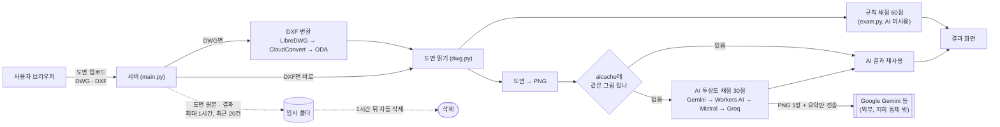

# 아키텍처 1장

W3(09-01~09-07) 산출물입니다. README의 mermaid 그림에 제출용으로 빠진
경로(DWG→DXF 변환, AI 폴백 순서, 캐시)와 개인정보 흐름을 더한 한 장입니다.

## 상자 설명

| 상자 | 무엇 | 남는 곳 |
|---|---|---|
| DXF 변환 | LibreDWG(`dwg2dxf`) 우선, 없으면 CloudConvert, 그다음 ODA File Converter. 셋 다 없으면 안내만 하고 중단 | 남기지 않음 |
| 규칙 채점 60점 | `exam.py`. AI를 부르지 않는 순수 코드, 실격 판정 5가지도 여기서 | — |
| AI 채점 30점 | 도면을 PNG 1장으로 바꿔 멀티모달 AI에게 채점위원 기준으로 물어봄. 원본 DWG/DXF는 안 보냄 | 아래 캐시만 |
| `aicache/` (저장소에 포함, 심사에서 그대로 보임) | 같은 그림을 다시 채점하지 않으려고 PNG 해시 → AI 응답을 저장. 지금은 배포판에 **미리 채워 둔 예시가 없어 비어 있고**, 실행 중 쌓인 캐시는 로컬(`%LOCALAPPDATA%/cad-checker/aicache`)에 남아 저장소에는 안 올라감 | 해시값 · AI 응답 JSON. 도면 이미지 자체는 캐시에 안 남음 |
| 임시 업로드 폴더 | 검사 한 번에만 씀. 최대 1시간, 최근 20건 넘으면 폴더째 삭제 | 최대 1시간 |

## 개인정보가 밖으로 나가는 지점은 하나뿐

**AI 채점 30점을 계산할 때, 도면을 그림으로 바꿔 Gemini(또는 폴백 순서상의 다음 제공자)로
보낸다.** 보내는 것은 PNG 1장과 파일 종류·투상법·뷰 개수 요약이고, 원본 DWG·DXF 파일은
절대 나가지 않는다. 표제란에 이름이 있으면 그 이미지 안에 이름이 함께 찍혀 나갈 수 있다 —
이 사실은 [`docs/policy.md`](policy.md)에도 명시했다. 그 외 경로(웹 화면 ↔ 서버, 임시
업로드 폴더, 규칙 채점 60점)는 전부 저희 서버 안에서만 돈다.

> 출처 — README.md의 기존 mermaid 그림과 표, `ai_review.py`(`SHIPPED_CACHE`/`CACHE_DIR`,
> 448행 부근 `_ask_gemini`), [`docs/policy.md`](policy.md) "밖으로 나가는 것" 절.
