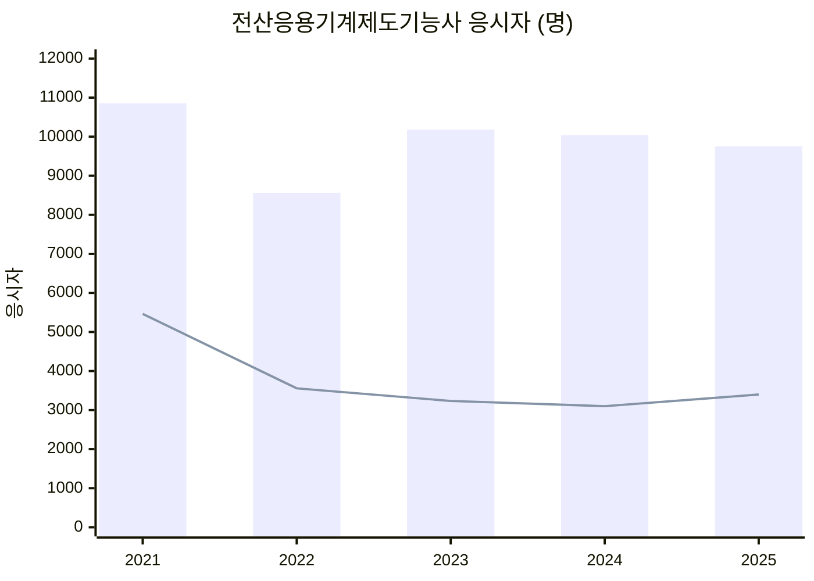
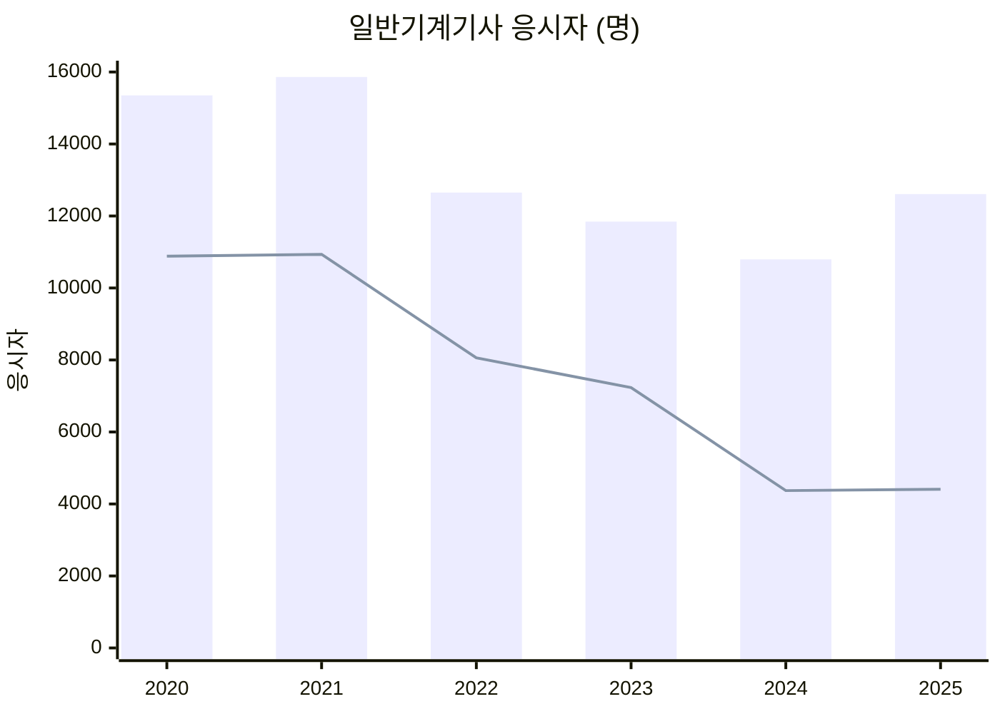
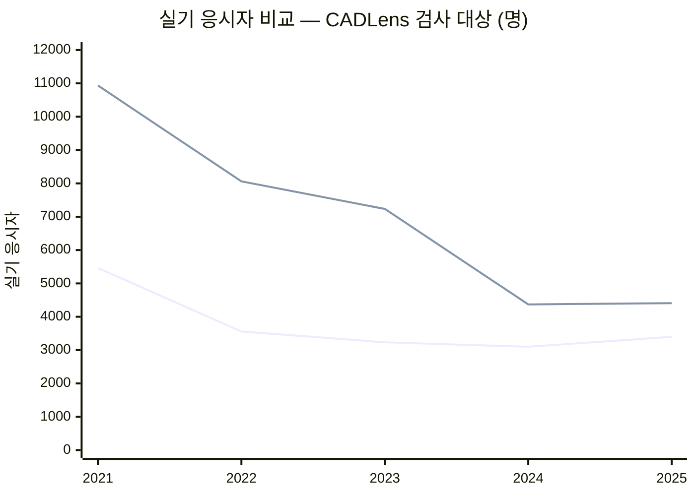

# 응시자 통계 (공통)

종목별 응시 규모입니다. 도입 순서를 정하는 두 축 중 하나입니다.

## 왜 필요한가

규칙 재사용률([`00_종합비교표.md`](00_종합비교표.md))은 **개발이 얼마나 쉬운가**만
알려 줍니다. **얼마나 많은 사람에게 닿는가**는 응시자 수가 결정합니다.
둘 다 봐야 도입 순서가 나옵니다.

재사용률이 높아도 응시자가 적으면 뒤로 미룰 근거가 되고, 반대도 마찬가지입니다.

## 출처와 신뢰도

| 구분 | 내용 |
|---|---|
| 1차 출처 | 한국산업인력공단 「국가기술자격 통계연보」 |
| 조회 경로 | Q-Net → 기술자격시험 → 자격검정통계 → 국가기술자격통계연보 |
| 기계 판독 | [공공데이터포털 오픈API `15037524`](https://www.data.go.kr/data/15037524/openapi.do) (국가자격 통계연보 정보) |
| 이 문서의 실제 출처 | **나무위키 각 종목 문서** — 통계연보를 옮긴 2차 출처 |

**이 문서의 숫자는 아직 1차 출처로 대조하지 않았습니다.** 2차 출처를 쓴 이유는
통계연보 원본이 PDF·엑셀 배포라 자동 대조에 시간이 들기 때문입니다.
검증은 위 오픈API로 자동화하는 것이 정확하며, 그 전까지 이 표는 **참고용**입니다.

숫자를 그대로 옮기지 않고 **응시자·합격자·합격률 세 값이 서로 맞는지 전부 검산**했습니다.
맞지 않는 행은 싣지 않고 아래에 따로 적었습니다.

## 전산응용기계제도기능사 — 현재 지원 중

| 연도 | 필기 응시 | 필기 합격 | 필기 합격률 | 실기 응시 | 실기 합격 | 실기 합격률 |
|---|---|---|---|---|---|---|
| 2021 | 10,856 | 5,435 | 50.1% | 5,464 | 2,475 | 45.3% |
| 2022 | 8,562 | 2,840 | 33.2% | 3,557 | 1,817 | 51.1% |
| 2023 | 10,180 | 3,135 | 30.8% | 3,234 | 1,620 | 50.1% |
| 2024 | 10,044 | 3,135 | 31.2% | 3,100 | 1,643 | 53.0% |
| 2025 | *확인 필요* | *확인 필요* | *확인 필요* | 3,399 | 1,721 | 50.6% |

**CADLens가 검사하는 것은 실기 도면입니다.** 필기 응시자는 검사 대상이 아니므로,
도입 효과를 볼 때는 **실기 응시자 수**를 봐야 합니다. 연 3,100~3,400명 수준입니다.

막대가 필기, 선이 실기입니다. 필기는 1만 명 안팎을 유지하지만 **실기는 2021년
5,464명에서 2022년 3,557명으로 한 번 떨어진 뒤 3,100~3,400명에 머물러 있습니다.**
CADLens의 검사 대상은 아래쪽 선입니다.

2023년과 2024년 필기 합격자가 3,135명으로 같아 전사 오류를 의심했으나,
각각 10,180명 대비 30.8%, 10,044명 대비 31.2%로 계산이 맞아 **우연의 일치**로 확인했습니다.

2025년 필기는 2차 출처에 9,752명 / 3,555명 / 34.4%로 적혀 있으나, 3,555는
9,752의 36.5%여서 합격률과 맞지 않습니다. 34.4%로 역산하면 3,355명이므로
**전사 오류로 보이나 확정 전까지 비워 둡니다.**

## 일반기계기사 — 도입 2순위

| 연도 | 필기 응시 | 필기 합격 | 필기 합격률 | 실기 응시 | 실기 합격 | 실기 합격률 |
|---|---|---|---|---|---|---|
| 2020 | 15,351 | 7,147 | 46.6% | 10,883 | 5,495 | 50.5% |
| 2021 | 15,861 | 7,612 | 48.0% | 10,935 | 4,902 | 44.8% |
| 2022 | 12,650 | 4,980 | 39.4% | 8,059 | 3,634 | 45.1% |
| 2023 | 11,844 | 4,723 | 39.9% | 7,234 | 2,977 | 41.2% |
| 2024 | 10,795 | 2,247 | 20.8% | 4,371 | 2,117 | 48.4% |
| 2025 | 12,608 | 3,148 | 25.0% | 4,408 | 1,944 | 44.1% |

전 행이 검산을 통과했습니다.

막대가 필기, 선이 실기입니다. **실기 감소가 필기보다 훨씬 가파릅니다.**
필기는 15,351명에서 12,608명으로 18% 줄어든 반면, 실기는 10,883명에서
4,408명으로 **60% 줄었습니다.**

## 아직 확인하지 못한 종목

| 종목 | 실기 응시자 | 상태 |
|---|---|---|
| 기계설계산업기사 | *확인 필요* | **1순위 종목. 우선 확보 대상** |
| 사출금형산업기사 | *확인 필요* | 2차 출처에 통계 없음 |
| 프레스금형산업기사 | *확인 필요* | 2차 출처에 통계 없음 |
| 치공구설계산업기사 | *확인 필요* | 통합 종목이라 최근 시행 없음 |

네 종목 모두 공개 2차 출처에 통계표가 없어 통계연보 원본을 봐야 합니다.
특히 **기계설계산업기사는 1순위로 정한 종목이므로 이 숫자가 비어 있는 것이
현재 가장 큰 공백**입니다.

[`00_종합비교표.md`](00_종합비교표.md)는 기계설계산업기사를 1순위로 두며
"치공구설계산업기사가 통합되어 대상 응시자가 가장 많다"고 적고 있습니다.
**이 진술은 아직 숫자로 뒷받침되지 않았습니다.** 통합이 사실이라는 근거는 있으나,
그 결과 응시자가 실제로 가장 많은지는 확인 전입니다.

## 지금까지 읽어 낼 수 있는 것

확인된 두 종목만 놓고 보면, 일반기계기사 실기 응시자는 **연 4,400명 안팎**으로
현재 지원 중인 전산응용기계제도기능사 실기(연 3,400명 안팎)보다 많습니다.

아래 선이 전산응용기계제도기능사(현재 지원), 위 선이 일반기계기사입니다.
**격차가 2021년 2배에서 2025년 1.3배로 좁혀졌습니다.** 일반기계기사를 붙이면
검사 대상 도면이 지금의 약 2.3배가 되지만, 그 종목도 줄고 있다는 뜻이기도 합니다.

일반기계기사는 개발 부담이 5개 종목 중 가장 작으므로
([`일반기계기사/README.md`](일반기계기사/README.md)), **적은 작업으로 검사 대상
도면을 두 배 이상 늘릴 수 있다**는 뜻이 됩니다.

다만 일반기계기사는 실기에 필답형이 있어 CADLens가 실기 전체를 다루지 못합니다.
응시자 수가 곧 검사 가능 범위는 아니라는 점을 함께 봐야 합니다.

두 종목 모두 **응시자가 줄어드는 추세**입니다. 일반기계기사 실기는 2020년 10,883명에서
2025년 4,408명으로 5년 만에 60% 감소했습니다. 확장 판단에는 현재 규모뿐 아니라
이 추세도 함께 보아야 합니다.

## 남은 일

- [ ] 통계연보 원본(또는 오픈API `15037524`)으로 위 두 종목 숫자 대조
- [ ] 기계설계산업기사 실기 응시자 수 확보 — 1순위 근거를 숫자로 확정
- [ ] 나머지 3개 종목 확보
- [ ] 2025년 전산응용 필기 합격자 수 확정 (3,355 / 3,555)
