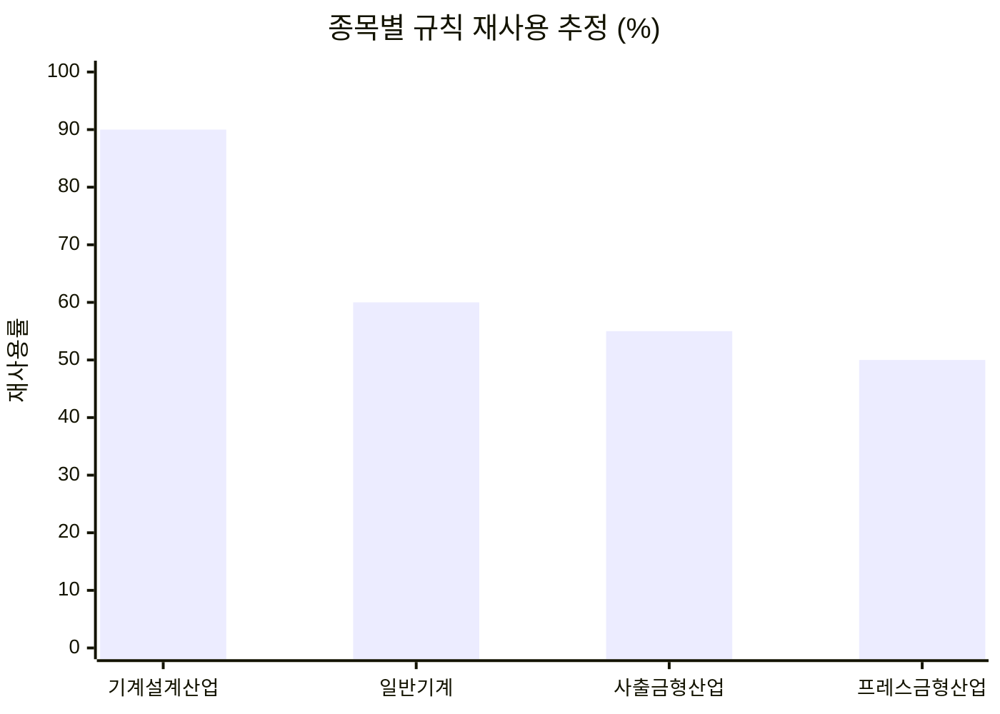

# example — 타 종목 확장 타당성 검토

CADLens를 **전산응용기계제도기능사 외의 국가기술자격으로 확대할 수 있는가**를
종목별로 따져 본 조사 기록입니다.

이 폴더에는 실행 코드가 없습니다. 구현 결과물이 아니라 **구현하기 전에 근거를
남긴 문서**이며, 저장소 루트의 코드(`rules.py`, `exam.py`)를 기준으로 작성했습니다.

## 왜 이 조사를 했는가

CADLens는 현재 전산응용기계제도기능사 실기 도면 한 종목만 검사합니다.
기능사 한 종목만 지원하면 쓸 수 있는 사람이 제한됩니다.

그런데 검사 로직의 뼈대인 `rules.py`의 검사 함수 11개와 `exam.py`의 루브릭 7개는,
종목에 종속된 상수(도면 크기, 최소 기호 개수, 표준 척도 목록)를 빼면
**KS 제도 규칙 일반**을 다룹니다. KS 규칙은 종목이 달라도 같습니다.

그렇다면 다른 종목에도 그대로 쓸 수 있어야 합니다.
"그래 보인다"와 "실제로 그렇다"는 다르므로, 항목 단위로 확인한 결과가 이 폴더입니다.

## 어떻게 조사했는가

종목마다 아래 순서를 밟았습니다. 방법론 전체는 [`97_검증방법론.md`](97_검증방법론.md)에 있습니다.

1. 한국산업인력공단 출제기준에서 **실기 과제 구성과 오작·실격 조건**을 확인한다
2. `rules.py`의 검사 함수 11개를 하나씩 그 종목 기준에 대보고
   **그대로 / 상수만 조정 / 신규 개발** 셋 중 하나로 판정한다
3. `exam.py`의 루브릭 7개 항목도 같은 방식으로 판정한다
4. 판정 결과를 합산해 **재사용률**을 내고, 신규 개발 부담과 함께 도입 순서를 정한다

확인되지 않은 것은 **"확인 필요"라고 적고 비워 뒀습니다.** 추정으로 채우면
그 위에 만든 검사 규칙이 응시자에게 틀린 지적을 하게 됩니다.

## 결론

| 종목 | 규칙 재사용 | 신규 개발 | 핵심 난관 | 도입 순서 |
|---|---|---|---|---|
| 기계설계산업기사 | **약 90%** | 중 | 3D 모델 채점 연계 | **1순위** |
| 일반기계기사 | 약 60% | 소 | 필답형은 검사 대상 밖 | 2순위 |
| 사출금형산업기사 | 약 55% | 대 | 빼기구배·파팅라인·냉각회로 | 3순위 |
| 프레스금형산업기사 | 약 50% | 대 | 다이-펀치 클리어런스(2개 부품도 비교) | 4순위 |
| 치공구설계산업기사 | — | — | 기계설계산업기사로 통합됨 | 제외 |



재사용률이 낮은 이유가 종목마다 다릅니다. **일반기계기사는 규칙이 안 맞아서가 아니라
필답형이 있어 커버리지가 낮은 것**이고, **금형 계열은 규칙은 맞지만 금형 전용 검사가
새로 필요해서** 낮습니다. 원인이 다르므로 대응도 다릅니다.

치공구설계산업기사는 별도 종목으로 넣지 않습니다.
넣으면 이미 통합된 시험이 따로 존재하는 것처럼 보이게 됩니다.

근거는 [`00_종합비교표.md`](00_종합비교표.md), 실행 계획은
[`99_도입_로드맵.md`](99_도입_로드맵.md)에 있습니다.

### 이 조사가 코드에 남긴 요구사항

로드맵 0단계는 종목 추가가 아니라 **기존 코드의 구조 정리**입니다.
현재 `exam.py`는 기능사 기준값을 모듈 상수로 박아 두고 있어, 두 번째 종목이
들어오는 순간 막힙니다.

```python
REQUIRED_SHEET = ("A3", 420.0, 297.0)
REQUIRED_THIRD_ANGLE = True
MIN_SURFACE_SYMBOLS = 3
MIN_FCF = 1
```

이 값들을 종목별 딕셔너리로 분리하되, **검사 함수 안에 `if 종목 == ...` 분기는
넣지 않습니다.** 종목이 5개가 되면 분기가 규칙마다 퍼져 손댈 수 없게 됩니다.
값만 분리하고 로직은 공유합니다.

## 폴더 구조

문서 세트는 **종목 1개당 47개 + 공통 5개** 구조입니다
([`98_용어_및_구조_공통.md`](98_용어_및_구조_공통.md) 참조).
각 종목 폴더 안의 번호는 같은 의미를 가집니다.

| 번호대 | 내용 |
|---|---|
| 01~09 | 개요 · 출제기준 · 채점기준 · 규칙 매핑 · 도입 타당성 결론 |
| 10~15 | KS 표준(치수·공차·표면거칠기·기하공차·도면 일반) 적용 |
| 16~26 | `rules.py` 검사 함수 11개 개별 분석 |
| 27~31 | 오작(DQ) 조건 개별 분석 |
| 32~38 | 채점 루브릭 7개 항목 개별 분석 |
| 39~47 | 일정 · 리스크 · 용어집 · 테스트 계획 등 도입 실무 |

```
example/
├── README.md                    이 문서
├── 00_종합비교표.md              5개 종목 한 장 비교 — 여기부터 읽으세요
├── 96_응시자_통계.md             종목별 응시 규모 (도입 순서의 두 번째 축)
├── 97_검증방법론.md              판정 기준과 근거 규칙
├── 98_용어_및_구조_공통.md       검사 파이프라인과 문서 세트 구조
├── 99_도입_로드맵.md             확정 시 실제 작업 순서
├── 기계설계산업기사/             24개 문서
├── 치공구설계산업기사/            9개 문서
├── 사출금형산업기사/              8개 문서
├── 프레스금형산업기사/            6개 문서
└── 일반기계기사/                  4개 문서
```

## 작성 현황

목표 241개 중 **57개(24%) 작성 완료**입니다.

| 종목 | 작성 | 비고 |
|---|---|---|
| 기계설계산업기사 | 24 / 47 | 1순위 종목이라 우선 작성 |
| 치공구설계산업기사 | 9 / 47 | 도입 실무 문서(39~47) 위주 |
| 사출금형산업기사 | 8 / 47 | 판단에 필요한 01~09 우선 |
| 프레스금형산업기사 | 6 / 47 | KS 적용 문서 위주 |
| 일반기계기사 | 4 / 47 | 착수 단계 |
| 공통 | 6 / 6 | 완료 |

**판단에 필요한 문서는 다 있습니다.** 도입 여부를 가르는 것은
`00_종합비교표.md`와 각 종목의 `07`(규칙 매핑) · `08`(추가 개발) · `09`(타당성 결론)이고,
1순위인 기계설계산업기사는 이 축이 채워져 있습니다.
남은 문서는 도입이 확정된 뒤 그 종목에서 이어서 씁니다.

각 종목 폴더 안의 문서가 아직 없는 번호를 참조하는 경우가 있습니다.
그 번호가 무엇을 담을지는 위 번호대 표에 정의돼 있으며, 빈 파일을 만들어 두는 대신
**작성된 문서만 올립니다.**

## 읽는 순서

1. [`00_종합비교표.md`](00_종합비교표.md) — 5개 종목을 한 장으로 비교. 결론이 여기 있습니다
2. [`96_응시자_통계.md`](96_응시자_통계.md) — 종목별 응시 규모. 도입 순서의 두 번째 축
3. [`기계설계산업기사/`](기계설계산업기사/) — 1순위 종목의 상세 근거
4. [`99_도입_로드맵.md`](99_도입_로드맵.md) — 실제 작업 순서와 선행 조건

## 한계

- **공식 배점은 비공개입니다.** 루브릭 배점은 공개문제와 채점 관행에서 끌어낸
  추정치이며, 문서 안에 추정이라고 밝혀 뒀습니다. 초기 도입 시 점수 표시를
  켜지 않고 항목별 충족 여부만 보여 주려는 이유입니다.
- **공개문제를 확보하지 못한 종목이 있습니다.** 로드맵은 회차 3개 이상 확보를
  선행 조건으로 두며, 확보 전에는 코드를 건드리지 않습니다.
- **여기 수치는 검토 결과이지 측정 결과가 아닙니다.** 실제 합격·불합격 도면으로
  검사 결과를 대조하는 검증이 남아 있습니다
  ([`97_검증방법론.md`](97_검증방법론.md), 각 종목 `44_테스트계획.md`).
